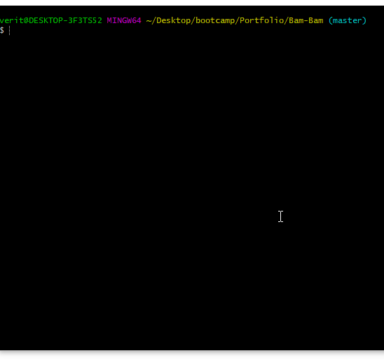

# Bam-Bam
# <h2> Welcome to my Bamazon project.
  # 
 In this project the user will be able to:

    1. View the current inventory.
    2. Purchase an item based on the products.
    3. View the price total for thier purchase and show updated lists.  
  # <h2> Installation Process:
  # 
 Please install the following packages to your application.

    1. mysql
    2. inquirer
    3. table
  # <h2> Viewing the Current Inventory:
   # 
