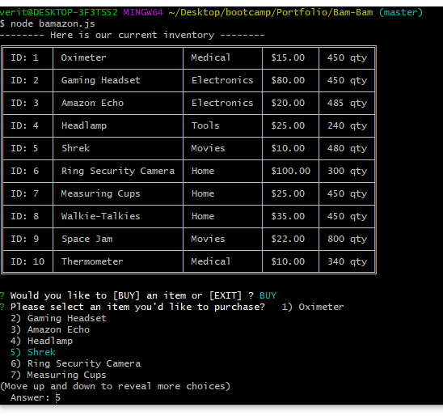

# Bam-Bam
# <h2> Welcome to my Bamazon project.
  # 
 In this project the user will be able to:

    1. View the current inventory.
    2. Purchase an item based on the products.
    3. View the price total for thier purchase and show updated lists.  
  # <h2> Installation Process:
  # 
 Please install the following packages to your application.

    1. mysql
    2. inquirer
    3. table
  # <h2> Viewing the Current Inventory:
   # 
   # 
 On start up the application should display to your user the current inventory of the store.

   # 
 The user will have access to the inquirer prompt to either buy an item or exit the application.

  # <h2> Purchase An Item 
   # 
   # 
 On selecting the "BUY" option a list of items that can be purchased will show for the user.
   # 
 After user will be asked to give an amount they would like to buy.
   # 
   # 
 The user will be required to enter a valid number.
 # <h2> View Price and Updated List
   # ![Image of price total and new table] (./images/Total.png "Totals")
  # 
 As shown above in the GIF of the purchase you will see the total price of the purchase as well as a new updated list of items and          quantities. 

  
